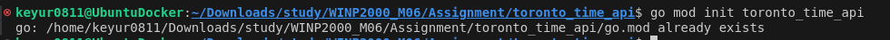

# Toronto Time API

A Go API that provides the current time in Toronto and logs requests to a MySQL database.

## Steps

### **Step 1: Install Required Tools on Ubuntu**

1. **Install Go**  
   Install Go on your Ubuntu system and verify the installation. 
    

2. **Install MySQL**  
   Install MySQL and secure the installation. Verify the MySQL service is running.  
   

3. **Enable Go Modules**  
   Initialize a new Go project using Go modules for dependency management.  
   

---

### **Step 2: Set Up the MySQL Database**

1. **Create the Database**  
   Log into MySQL and create the `toronto_time_db` database for storing timestamps.  
   

2. **Create the Table**  
   Create a table (`time_log`) to store timestamps of API requests.  
   

3. **Create a MySQL User**  
   Create a specific user (`api_user`) for the API to interact with the database securely.  
   

---

### **Step 3: Build the Go API**

1. **Install Required Go Modules**  
   Install necessary Go modules for MySQL connection and routing (e.g., `gorilla/mux`, `go-sql-driver/mysql`).  
   
   

2. **Create the API Code**  
   Implement the API logic, including the `/current-time` and `/logged-times` endpoints. 

---

### **Step 4: Run the API**

1. **Run the API**  
   Execute the Go code to start the server on port `8080`. 
    

---

### **Step 5: Test the API**

1. **Test `/current-time` Endpoint**  
   Use `curl` or Postman to test the `/current-time` endpoint and get the current time in Toronto.  
    

   

2. **Test `/logged-times` Endpoint**  
   Use `curl` or Postman to test the `/logged-times` endpoint to view the list of logged timestamps.  
   
   
    

---

### **Step 6: Dockerize the Application**

1. **Create Dockerfile and Docker Compose**  
   Build a Docker image for the API and set up Docker Compose for both the API and MySQL container.  

2. **Build and Run with Docker**  
   Use `docker-compose` to build and run the application with the required services.  
   
